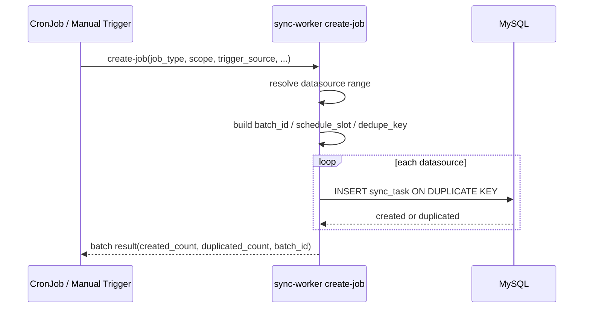
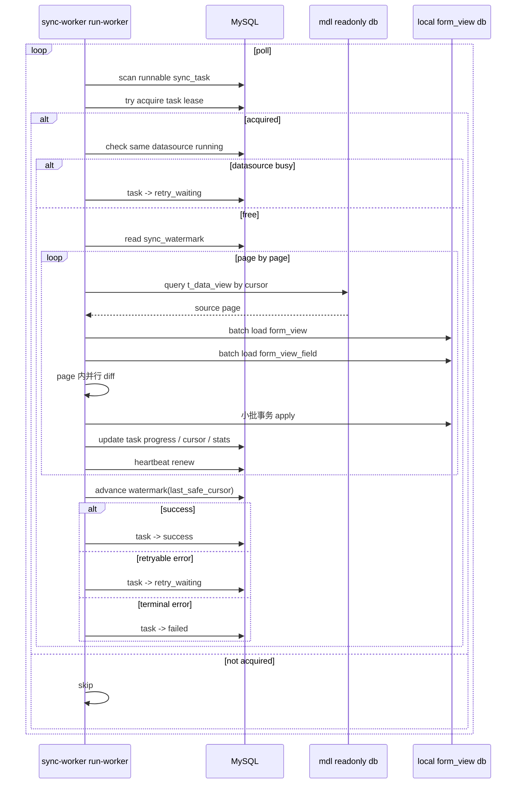

# form-view/sync 技术架构方案（2 张表版，sync-worker 二合一模式）

## 1. 文档目标

本文档用于指导研发对 `mdl -> data-view` 的同步能力进行评审与开发落地。

方案基于以下前提：

- 当前采用 **2 张表模型**：
  - `t_form_view_sync_task`
  - `t_form_view_sync_watermark`
- 不再保留 `job` 主表与 `job_ds` 子表
- 同步执行粒度为 **datasource**
- `sync-worker` 采用 **二合一模式**：
  - `create-job`
  - `run-worker`
- 定时调度优先由 **K8S CronJob** 触发
- 手工触发作为补充能力存在

---

## 2. 方案总览

### 2.1 核心思路

整个同步系统拆成两个阶段：

1. **create-job**：负责把“同步意图”转换成数据库里的可执行任务
2. **run-worker**：负责消费并执行这些任务

两者共享同一套数据模型与 domain 逻辑，但运行职责严格分开。

### 2.2 核心结论

当前阶段最推荐的形态是：

- 一个工程：`sync-worker`
- 两个运行模式：
  - `sync-worker create-job`
  - `sync-worker run-worker`
- K8S CronJob 优先调用 `create-job`
- `run-worker` 作为常驻 Deployment 执行同步任务

---

## 3. 2 张表模型说明

### 3.1 `t_form_view_sync_task`

这张表表示：

> 一个 datasource 的一次同步执行任务

它同时承担以下职责：

- 调度任务
- 执行状态
- 重试控制
- 分布式执行租约
- watermark 前后值记录
- 执行结果与统计

#### 关键字段职责

- 基础标识：`f_id`、`f_batch_id`、`f_datasource_id`
- 调度语义：`f_job_type`、`f_trigger_source`、`f_schedule_slot`、`f_dedupe_key`
- 状态控制：`f_status`、`f_attempt_no`、`f_max_attempt`、`f_next_run_at`
- 执行租约：`f_lock_owner`、`f_lock_until`、`f_heartbeat_at`、`f_fencing_token`
- watermark 过程值：`f_watermark_before`、`f_watermark_after`、`f_cursor_json`
- 统计字段：`f_view_created / updated / deleted`、`f_field_created / updated / deleted`
- 错误结果：`f_last_error_code`、`f_last_error_msg`、`f_result_json`

### 3.2 `t_form_view_sync_watermark`

这张表表示：

> 一个 datasource 的长期同步进度

它承担：

- 增量同步起点记录
- 精确游标记录
- 最近一次成功 full / reconcile 信息记录

#### 关键字段职责

- `f_watermark_type`：当前固定为 `change_time`
- `f_watermark_value`：安全水位值
- `f_watermark_cursor_json`：精确游标
- `f_last_success_task_id`：最近一次成功任务 ID
- `f_last_full_sync_at` / `f_last_reconcile_at`：最近成功 full / reconcile 时间

---

## 4. 组件与职责

### 4.1 组件图

```text
K8S CronJob ───────┐
                   ├──> sync-worker create-job ───> t_form_view_sync_task
手工触发/运维命令 ──┘                                  t_form_view_sync_watermark
                                                             │
                                                             ▼
                                                   sync-worker run-worker
                                                         │        │
                                                         │        ├──> 读取 mdl 只读库 t_data_view
                                                         │
                                                         └──> 写本地 form_view / form_view_field
```

### 4.2 `create-job` 的职责

`create-job` 只负责 **任务生成**，不负责真正同步。它负责：

1. 接收触发参数
2. 解析 datasource 范围
3. 计算 `schedule_slot`
4. 生成 `batch_id`
5. 为每个 datasource 生成一条 `sync_task`
6. 基于 `dedupe_key` 做幂等去重
7. 输出本轮创建结果

### 4.3 `run-worker` 的职责

`run-worker` 是 **常驻执行进程**，只消费已经创建好的 `sync_task`。它负责：

1. 周期扫描可执行任务
2. 抢占执行权
3. 读取 watermark
4. 读取源 `t_data_view`
5. 批量加载本地 `form_view / form_view_field`
6. diff + apply
7. 更新任务统计与结果
8. 推进 watermark
9. 失败重试与续租

---

## 5. 触发模型设计

### 5.1 定时触发：K8S CronJob 优先

K8S CronJob 到点后，拉起一个一次性 Pod，执行：

```bash
./sync-worker create-job --job-type=incremental --scope=all-active
```

或者：

```bash
./sync-worker create-job --job-type=reconcile --scope=shard --shard-total=4 --shard-index=1
```

### 5.2 手工触发：补充路径

手工触发可以通过：

- one-off Pod
- 运维任务平台
- `kubectl create job`
- CI/CD pipeline

执行：

```bash
./sync-worker create-job --job-type=full --datasource-ids=ds_1001,ds_1002 --trigger-source=manual
```

### 5.3 任务创建粒度

推荐策略：

> 一次触发生成一批 datasource 级 task，而不是一个抽象主任务。

也就是说：

- “这一轮调度”由 `batch_id` 表示
- “真正执行单元”由 `sync_task` 表示

---

## 6. `create-job` 详细流程

### 6.1 输入参数建议

建议 `create-job` 至少支持：

- `--job-type=incremental|reconcile|full`
- `--scope=all-active|datasource-list|shard`
- `--datasource-ids=...`
- `--shard-total`
- `--shard-index`
- `--trigger-source=manual|schedule|retry|system`
- `--schedule-slot=...`
- `--requested-by`
- `--requested-name`
- `--reason`

### 6.2 内部处理逻辑

1. 解析范围
   - `all-active`：读取所有启用且允许同步的 datasource
   - `datasource-list`：直接用传入列表
   - `shard`：按 shard 规则筛选 datasource
2. 生成 `batch_id`
3. 计算 `schedule_slot`
4. 按 datasource 生成 `dedupe_key`
5. 幂等创建 `sync_task`
6. 返回本轮创建结果

### 6.3 `create-job` 时序图



---

## 7. `run-worker` 详细流程

### 7.1 `run-worker` 的本质

`run-worker` 是一个后台执行引擎，主循环为：

```text
poll -> acquire -> check datasource conflict -> heartbeat -> run sync -> finish/retry -> continue
```

### 7.2 常驻主循环

#### Step 1：周期轮询
每隔 2~5 秒查询：

- `status in ('pending', 'retry_waiting')`
- `next_run_at <= now`

#### Step 2：尝试抢占
通过原子 SQL 把任务变更为：

- `status = running`
- 更新 `lock_owner / lock_until / heartbeat_at`
- `attempt_no + 1`
- `fencing_token + 1`

#### Step 3：datasource 冲突检查
如果同 datasource 已存在其他有效 `running` 任务：

- 当前任务回退 `retry_waiting`
- `next_run_at = now + short_backoff`

#### Step 4：启动心跳续租
执行期间定期更新：

- `f_lock_until`
- `f_heartbeat_at`

#### Step 5：执行 datasource 同步
1. 读取 `sync_watermark`
2. 构造 cursor
3. 分页读取 `mdl.t_data_view`
4. 批量读取本地 `form_view / form_view_field`
5. diff
6. apply
7. 更新 `f_watermark_after / f_cursor_json / stats`

#### Step 6：推进长期 watermark
把 datasource 的长期安全进度推进到：

- `f_watermark_value`
- `f_watermark_cursor_json`
- `f_last_success_task_id`

#### Step 7：结束任务
根据结果更新为：

- `success`
- `retry_waiting`
- `failed`

### 7.3 `run-worker` 时序图



---

## 8. watermark 设计与推进规则

### 8.1 当前源表下的 `change_time`

由于当前 `t_data_view` 没有单独的 `f_change_time` 字段，逻辑上统一定义：

```text
change_time = GREATEST(f_create_time, f_update_time, f_delete_time)
```

这是为了同时覆盖：

- create
- update
- delete

### 8.2 精确游标

`watermark` 的真实断点是一个复合游标：

```json
{
  "change_time": 1710001234567,
  "view_id": "dv_000123"
}
```

### 8.3 推进原则

watermark 只能推进到：

> 连续成功前缀的最后位置

不能推进到：

- 本次扫描到的最大 `change_time`
- 本次成功条数对应的最大时间
- 失败洞之后的位置

失败对象样本、失败原因写 `sync_task.f_result_json`，长期进度只写 `sync_watermark`。

---

## 9. diff + apply 方案

### 9.1 基本策略

推荐采用：

> 分页读取源 -> 批量读取本地 -> 内存建索引 -> page 内并行 diff -> 小批事务 apply

### 9.2 并发模型

- datasource 之间：可并行
- 单 datasource 内：page 顺序执行，保证 watermark 正确
- 单 page 内：可用 goroutine worker pool 并行处理：
  - `f_fields` 解析
  - hash 计算
  - 单 view diff

### 9.3 本地对象匹配

视图匹配键：

- 优先：`source_view_id = t_data_view.f_view_id`
- 兜底：`datasource_id + technical_name`

字段匹配键：

- 优先：`original_name`
- 兜底：`name`

---

## 10. 失败与重试

### 10.1 可重试失败

例如：

- 读源失败
- 本地 DB 短暂故障
- 网络超时

处理方式：

- `status = retry_waiting`
- `next_run_at = now + backoff`

### 10.2 不可重试失败

例如：

- 参数错误
- schema 不兼容
- 数据严重非法

处理方式：

- `status = failed`

### 10.3 部分成功部分失败

处理方式：

- `sync_task` 记录统计与失败样本
- `sync_watermark` 只推进到 `last_safe_cursor`

---

## 11. go-zero 下的工程落地方案

### 11.1 推荐目录结构

```text
sync-worker/
  etc/
    sync-worker.yaml
  internal/
    config/
    svc/
    model/
    command/
      createjob/
        create_job.go
      worker/
        poller.go
        dispatcher.go
        runner.go
        heartbeat.go
    domain/
      task_service.go
      watermark_service.go
      mdl_reader.go
      diff_engine.go
      apply_service.go
  syncworker.go
```

### 11.2 二进制入口建议

#### 常驻 worker

```bash
./sync-worker run-worker
```

#### CronJob 创建任务

```bash
./sync-worker create-job --job-type=incremental --scope=all-active --trigger-source=schedule
```

#### 手工补偿

```bash
./sync-worker create-job --job-type=full --scope=datasource-list --datasource-ids=ds_1001,ds_1002 --trigger-source=manual
```

---

## 12. K8S 部署建议

### 12.1 常驻 Deployment

部署一个或多个 `run-worker` Pod：

- 通过数据库抢占控制任务唯一执行
- 通过 datasource 冲突检查避免同 datasource 并发执行

### 12.2 CronJob

为不同 job 类型配置不同 CronJob：

- incremental：高频，默认全活跃 datasource
- reconcile：低频，全量或按 shard
- full：默认不定时，优先手工触发

---

## 13. 风险与控制点

### 13.1 CronJob 可能重复创建

通过：

- `concurrencyPolicy: Forbid`
- `dedupe_key` 幂等插入

双重控制。

### 13.2 datasource 并发冲突

通过：

- 任务抢占
- 同 datasource active running 检查

控制。

### 13.3 watermark 不精确推进

通过：

- `(change_time, view_id)` 精确游标
- 只推进到 `last_safe_cursor`

控制。

### 13.4 大批量 datasource 调度过重

通过：

- `scope=shard`
- worker `MaxDatasourceParallelism`
- page 小批执行

控制。

---

## 14. 研发实施顺序建议

### 第一阶段
1. 落 2 张表
2. `create-job` 命令
3. `run-worker` 常驻执行
4. 单 datasource incremental 跑通

### 第二阶段
1. K8S CronJob 接入
2. reconcile 跑通
3. 手工补偿命令跑通
4. metrics / 告警

### 第三阶段
1. full / shard 调度
2. 更细失败样本治理
3. 视需要补管理 API

---

## 15. 最终建议

这版 2 表架构下，最合理的技术形态是：

> `sync-worker` 一个工程，两个命令模式；CronJob 负责定时创建 datasource 级 task，常驻 worker 负责消费 task 并执行同步。

其中：

- `create-job` 解决“这轮应该创建哪些任务”
- `run-worker` 解决“这些任务怎么执行、怎么重试、怎么推进 watermark”
- `batch_id` 解决“这轮调度”的语义
- `dedupe_key` 解决“同调度槽位去重”
- `watermark` 解决“长期增量进度”


