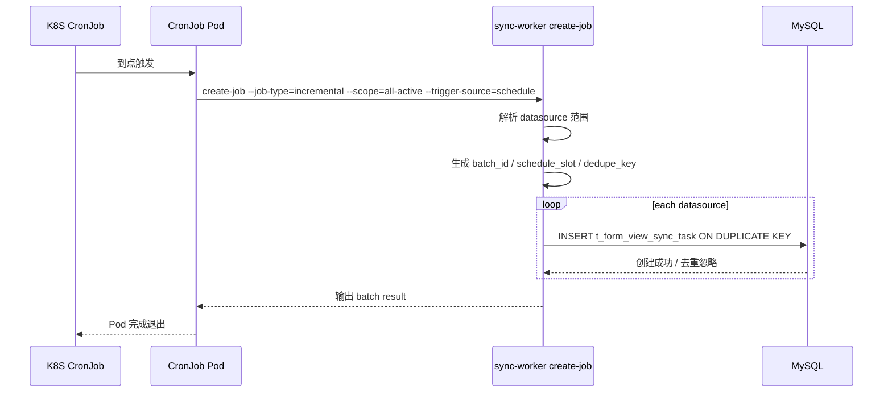
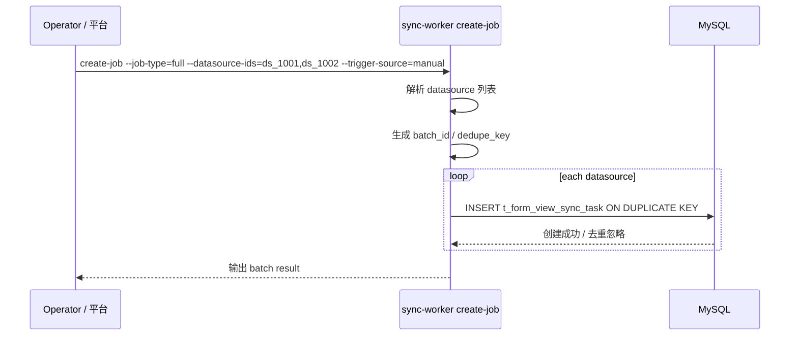
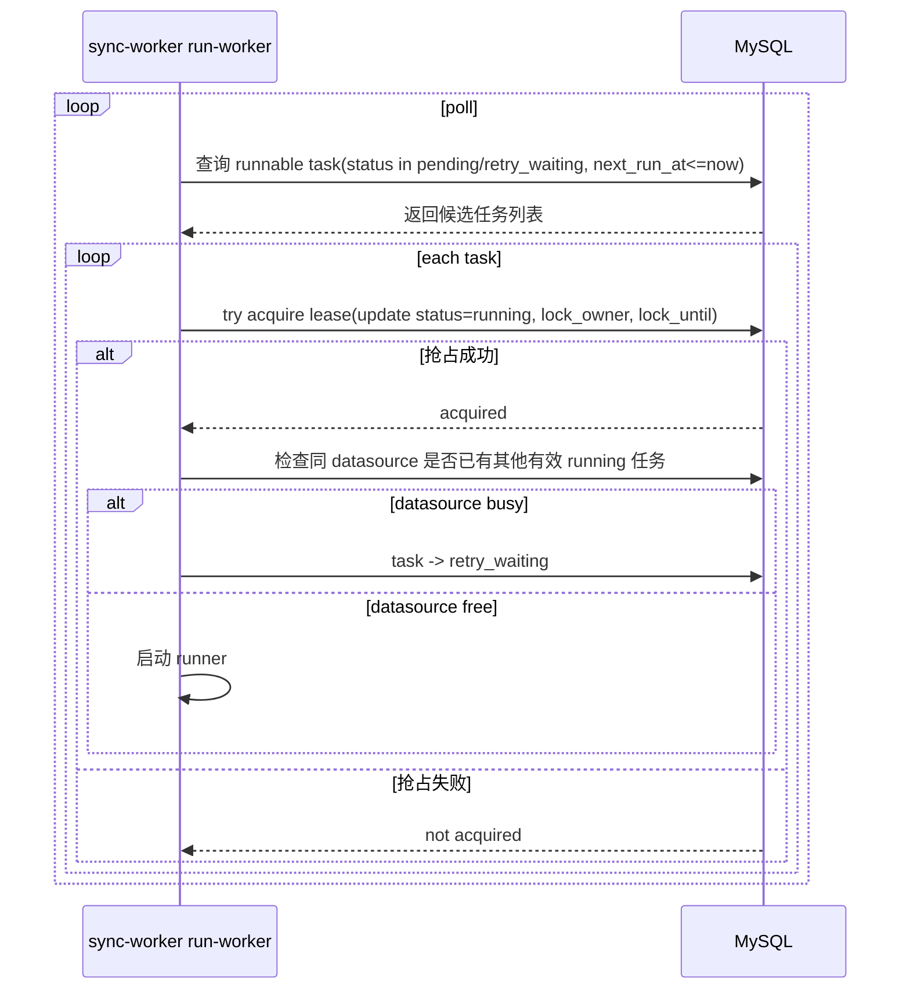
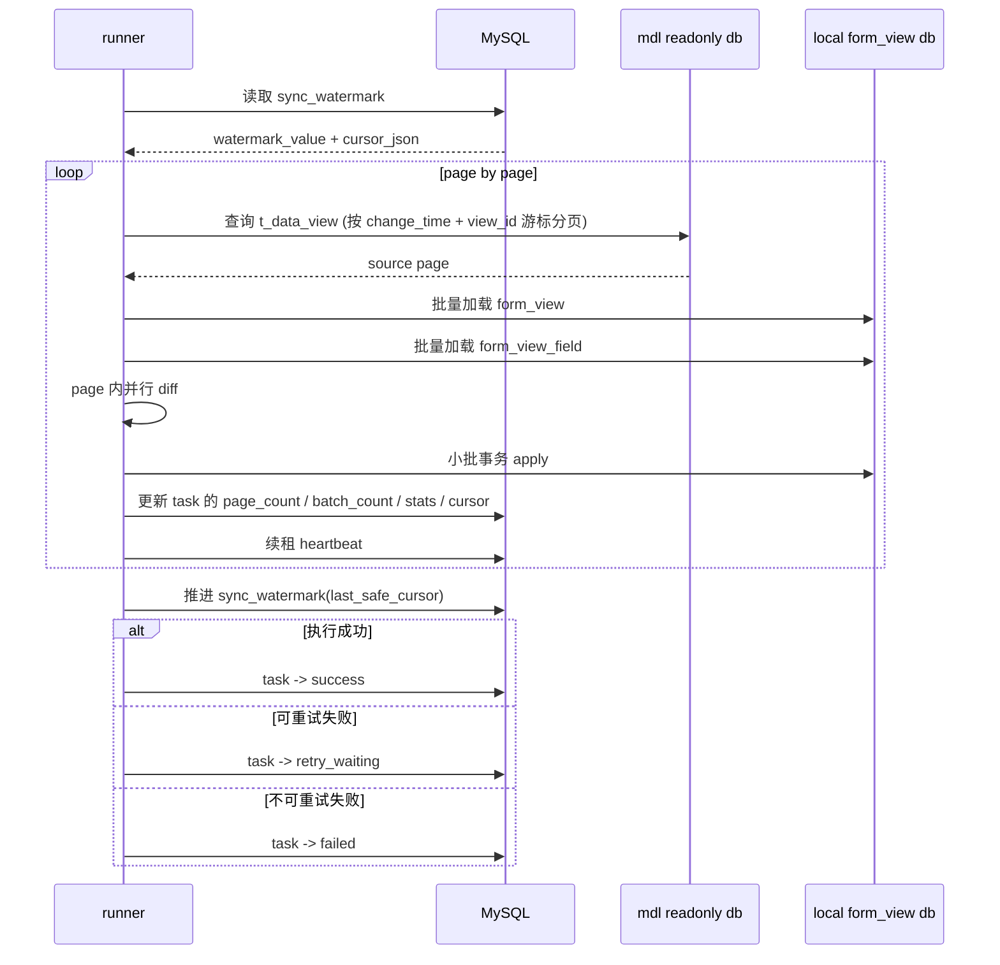
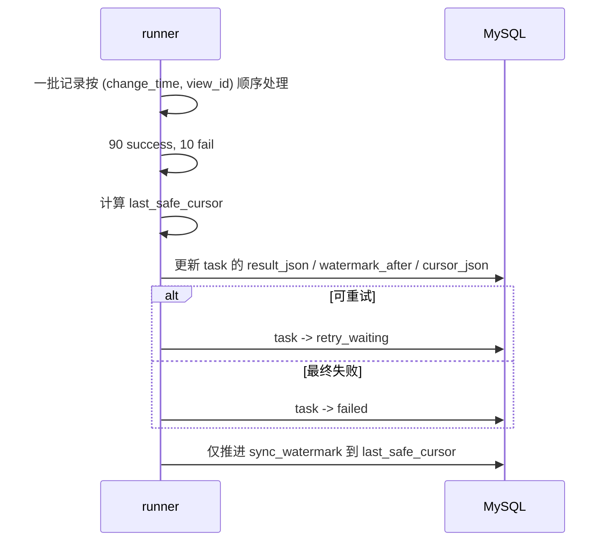

# form-view/sync 研发评审包（2 张表版）

## 1. 文档目的

本文档用于支撑 `form-view/sync` 的研发评审与开发落地，覆盖以下内容：

1. 研发评审版关键时序图
2. K8S CronJob YAML 样例
3. `sync-worker` 二合一模式命令行参数规范
4. 运行约束与默认值建议

本文档基于以下前提：

- 采用 **2 张表模型**：
  - `t_form_view_sync_task`
  - `t_form_view_sync_watermark`
- 采用 **sync-worker 二合一模式**：
  - `create-job`
  - `run-worker`
- **K8S CronJob 优先** 负责定时创建任务
- `mdl` 为 core，`data-view` 为 application
- 源表为 `mdl.t_data_view`
- 目标表为本地 `form_view / form_view_field`

---

## 2. 总体流程概览

```text
K8S CronJob / 手工触发
        -> sync-worker create-job
        -> 生成 t_form_view_sync_task（datasource 粒度）
        -> sync-worker run-worker 常驻扫描任务
        -> 抢占 -> 读取 watermark -> 读取 t_data_view
        -> diff + apply -> 推进 watermark -> 结束 / 重试
```

---

## 3. 关键时序图

## 3.1 定时创建任务时序图（K8S CronJob 优先）



### 说明

- CronJob 只负责“触发创建任务”，不负责真正执行同步。
- 每次调度创建的是 **一批 datasource 级 task**，不是一个抽象主任务表。
- 一轮触发的任务通过 `batch_id` 表达批次语义。
- 同一 datasource、同一 `job_type`、同一 `schedule_slot` 通过 `dedupe_key` 去重。

---

## 3.2 手工创建任务时序图



### 说明

- 手工触发适合：
  - 指定 datasource 的 full
  - reconcile 补偿
  - 发布后修复
  - 单 datasource 重跑

---

## 3.3 run-worker 扫描与抢占时序图



### 说明

- `run-worker` 是常驻进程。
- 它的职责是：**扫描任务、抢占任务、执行任务、续租、重试、更新状态**。
- 当前 2 表版没有独立 lease 表，因此 datasource 互斥在 `run-worker` 层做业务检查。

---

## 3.4 单 datasource 同步执行时序图



### 说明

- watermark 只推进到 `last_safe_cursor`，不能推进到扫描到的最大位置。
- `last_safe_cursor` 必须满足“连续成功前缀”的规则。
- `cursor_json` 结构建议为：

```json
{
  "change_time": 1710001234567,
  "view_id": "dv_000123"
}
```

---

## 3.5 部分成功部分失败时序图



### 说明

- `sync_task` 负责记录执行结果与失败样本。
- `sync_watermark` 只负责记录长期安全进度。
- 二者不能混用。

---

## 4. K8S CronJob YAML 样例

下面给 3 个样例：

1. incremental 定时创建
2. reconcile 分片创建
3. 手工 one-off Job 样例

---

## 4.1 incremental CronJob（推荐主路径）

```yaml
apiVersion: batch/v1
kind: CronJob
metadata:
  name: form-view-sync-incremental
  namespace: data-view
spec:
  schedule: "*/5 * * * *"
  timeZone: "Asia/Shanghai"
  concurrencyPolicy: Forbid
  startingDeadlineSeconds: 300
  successfulJobsHistoryLimit: 1
  failedJobsHistoryLimit: 3
  jobTemplate:
    spec:
      template:
        spec:
          restartPolicy: Never
          containers:
            - name: sync-worker
              image: your-registry/sync-worker:latest
              imagePullPolicy: IfNotPresent
              command:
                - /app/sync-worker
                - create-job
                - --job-type=incremental
                - --scope=all-active
                - --trigger-source=schedule
              env:
                - name: APP_ENV
                  value: prod
                - name: TZ
                  value: Asia/Shanghai
```

### 说明

- `concurrencyPolicy: Forbid`：避免同一个 CronJob 的上一次创建任务还未结束时，又触发下一次。
- `timeZone` 建议显式配置。
- `startingDeadlineSeconds` 控制错过调度后的补触发窗口。
- `create-job` 只负责创建任务，不做同步执行。

---

## 4.2 reconcile CronJob（按 shard 分片）

```yaml
apiVersion: batch/v1
kind: CronJob
metadata:
  name: form-view-sync-reconcile-shard-0
  namespace: data-view
spec:
  schedule: "0 2 * * *"
  timeZone: "Asia/Shanghai"
  concurrencyPolicy: Forbid
  startingDeadlineSeconds: 1800
  successfulJobsHistoryLimit: 1
  failedJobsHistoryLimit: 3
  jobTemplate:
    spec:
      template:
        spec:
          restartPolicy: Never
          containers:
            - name: sync-worker
              image: your-registry/sync-worker:latest
              imagePullPolicy: IfNotPresent
              command:
                - /app/sync-worker
                - create-job
                - --job-type=reconcile
                - --scope=shard
                - --shard-total=4
                - --shard-index=0
                - --trigger-source=schedule
```

### 说明

- reconcile 比 incremental 重，datasource 多时建议按 shard 分片。
- 可以配置多个 CronJob，分别覆盖不同 shard。

---

## 4.3 手工 one-off Job 样例（full / 定向补偿）

```yaml
apiVersion: batch/v1
kind: Job
metadata:
  name: form-view-sync-full-manual-001
  namespace: data-view
spec:
  template:
    spec:
      restartPolicy: Never
      containers:
        - name: sync-worker
          image: your-registry/sync-worker:latest
          imagePullPolicy: IfNotPresent
          command:
            - /app/sync-worker
            - create-job
            - --job-type=full
            - --scope=datasource-list
            - --datasource-ids=ds_1001,ds_1002
            - --trigger-source=manual
            - --requested-by=ops_user_001
            - --requested-name=ops
            - --reason=manual full repair
```

---

## 5. `sync-worker` 命令行参数规范

## 5.1 总体设计

`sync-worker` 使用两个子命令：

```bash
./sync-worker create-job
./sync-worker run-worker
```

---

## 5.2 `create-job` 参数规范

### 基础参数

| 参数 | 必填 | 示例 | 说明 |
|---|---|---|---|
| `--job-type` | 是 | `incremental` | 任务类型：`incremental` / `reconcile` / `full` |
| `--scope` | 是 | `all-active` | 范围：`all-active` / `datasource-list` / `shard` |
| `--trigger-source` | 否 | `schedule` | 触发来源：`manual` / `schedule` / `retry` / `system` |
| `--reason` | 否 | `daily incremental` | 触发原因 |

### 范围相关参数

| 参数 | 适用 scope | 示例 | 说明 |
|---|---|---|---|
| `--datasource-ids` | `datasource-list` | `ds_1001,ds_1002` | 指定 datasource 列表 |
| `--shard-total` | `shard` | `4` | 总 shard 数 |
| `--shard-index` | `shard` | `1` | 当前 shard 索引，从 0 开始 |

### 审计相关参数

| 参数 | 必填 | 示例 | 说明 |
|---|---|---|---|
| `--requested-by` | 否 | `ops_user_001` | 触发人 ID |
| `--requested-name` | 否 | `ops` | 触发人名称 |
| `--schedule-slot` | 否 | `1712647500000` | 定时槽位（通常 schedule 由程序自动算） |

### 推荐示例

#### incremental 全量活跃 datasource
```bash
./sync-worker create-job \
  --job-type=incremental \
  --scope=all-active \
  --trigger-source=schedule
```

#### reconcile 分片
```bash
./sync-worker create-job \
  --job-type=reconcile \
  --scope=shard \
  --shard-total=4 \
  --shard-index=1 \
  --trigger-source=schedule
```

#### full 指定 datasource
```bash
./sync-worker create-job \
  --job-type=full \
  --scope=datasource-list \
  --datasource-ids=ds_1001,ds_1002 \
  --trigger-source=manual \
  --requested-by=ops_user_001 \
  --requested-name=ops \
  --reason="manual full repair"
```

---

## 5.3 `run-worker` 参数规范

### 基础参数

| 参数 | 必填 | 示例 | 说明 |
|---|---|---|---|
| `--worker-id` | 否 | `worker-pod-01` | 当前 worker 实例 ID，默认自动生成 |
| `--poll-interval-ms` | 否 | `3000` | 轮询任务间隔 |
| `--pick-limit` | 否 | `20` | 单轮最多抓取候选任务数 |
| `--lease-ms` | 否 | `90000` | 任务租约时长 |
| `--heartbeat-ms` | 否 | `20000` | 心跳续租间隔 |
| `--max-parallelism` | 否 | `4` | 最大 datasource 并发数 |
| `--page-size` | 否 | `300` | 单次读取 `t_data_view` 页大小 |
| `--diff-workers` | 否 | `8` | 单 page 内 diff 并发 worker 数 |

### 重试参数

| 参数 | 必填 | 示例 | 说明 |
|---|---|---|---|
| `--retry-backoff-ms` | 否 | `60000,300000,900000` | 重试退避序列 |

### 推荐示例

```bash
./sync-worker run-worker \
  --poll-interval-ms=3000 \
  --pick-limit=20 \
  --lease-ms=90000 \
  --heartbeat-ms=20000 \
  --max-parallelism=4 \
  --page-size=300 \
  --diff-workers=8 \
  --retry-backoff-ms=60000,300000,900000
```

---

## 6. 运行逻辑说明

## 6.1 `create-job` 运行逻辑

1. 解析参数
2. 解析 datasource 范围
3. 生成 `batch_id`
4. 计算 `schedule_slot`
5. 按 datasource 生成 `dedupe_key`
6. `INSERT ... ON DUPLICATE KEY UPDATE` 写 `t_form_view_sync_task`
7. 输出创建结果：
   - created_count
   - duplicated_count
   - batch_id

### 规则

- schedule 场景：优先用 `job_type + datasource_id + schedule_slot` 去重
- manual 场景：建议也做去重，但可允许带更细粒度 reason / operator 组合
- 同 datasource 若已有 active task（`pending / running / retry_waiting`），默认不重复创建同类 task

---

## 6.2 `run-worker` 运行逻辑

### 主循环

```text
poll runnable task
  -> try acquire
  -> check datasource conflict
  -> heartbeat goroutine
  -> read watermark
  -> read source page
  -> batch load local view/field
  -> page 内并行 diff
  -> 小批 apply
  -> update task progress
  -> advance watermark
  -> mark success/retry_waiting/failed
```

### 说明

- `run-worker` 是后台执行引擎，不参与任务生成。
- 单 datasource 内 page 顺序执行，保证 watermark 正确。
- page 内可用 goroutine worker pool 并行处理 `f_fields` 解析、hash 计算、单 view diff。

---

## 7. 默认运行策略建议

## 7.1 job 类型策略

| job_type | 创建方式 | 默认范围 | 是否推荐定时 |
|---|---|---|---|
| `incremental` | K8S CronJob | 全部活跃 datasource | 推荐 |
| `reconcile` | K8S CronJob | 全部或按 shard | 推荐 |
| `full` | 手工创建优先 | 指定 datasource / 指定范围 | 不建议默认定时 |

---

## 7.2 并发策略

- datasource 间：可并行
- 单 datasource 内：page 串行
- 单 page 内：diff 并行
- watermark 推进：串行

---

## 7.3 推荐默认值

| 参数 | 默认值 |
|---|---|
| `poll_interval_ms` | `3000` |
| `pick_limit` | `20` |
| `lease_ms` | `90000` |
| `heartbeat_ms` | `20000` |
| `max_parallelism` | `4` |
| `page_size` | `300` |
| `diff_workers` | `8` |
| `retry_backoff_ms` | `60000,300000,900000` |

---

## 8. 研发评审重点

研发评审时，建议重点对齐以下事项：

1. **是否接受 2 表模型**
   - 无主任务表，批次语义由 `batch_id` 表达
2. **是否接受二合一 `sync-worker` 模式**
   - `create-job`
   - `run-worker`
3. **是否接受 K8S CronJob 优先创建任务**
4. **是否接受 `dedupe_key` 去重规则**
5. **是否接受 watermark 使用 `change_time + cursor_json`**
6. **是否接受 datasource 间并行、单 datasource 内 page 串行**
7. **是否第一版仅同步元数据视图**
   - 如是，读取源时应限制 `f_group_id = f_data_source_id`

---

## 9. 最终建议

当前阶段最合理的落地方式是：

- **一个 `sync-worker` 工程**
- **两个命令模式**
  - `create-job`
  - `run-worker`
- **K8S CronJob 优先负责定时创建任务**
- **`run-worker` 常驻负责消费 datasource 级 task**
- **2 张表承担任务状态与长期 watermark 事实源**

这样可以在保证实现足够轻量的同时，把：

- 调度去重
- 状态跟踪
- 增量执行
- watermark 推进
- 失败重试

全部跑通，并且后续仍然可以平滑扩展出 API 管理面。
